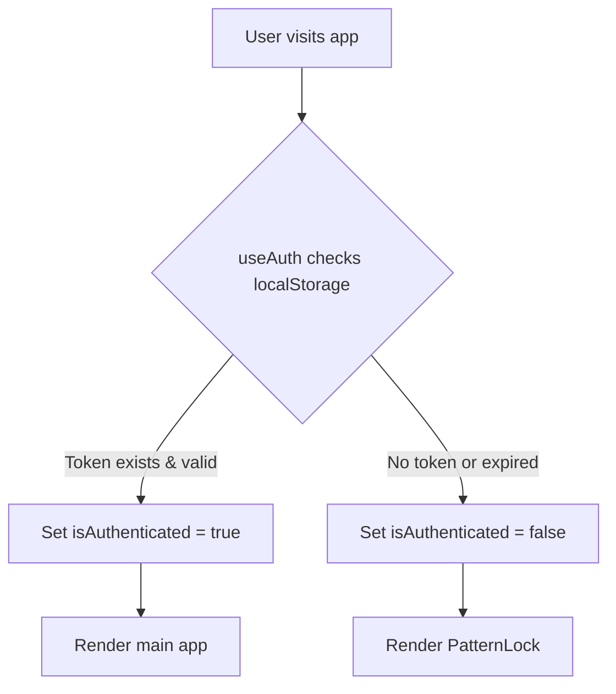

# Pattern Lock Gate Mechanism - Design & Implementation

## Table of Contents
1. [Overview](#overview)
2. [Architecture](#architecture)
3. [Component Breakdown](#component-breakdown)
4. [Authentication Flow](#authentication-flow)
5. [API Design](#api-design)
6. [Security Features](#security-features)
7. [Vercel Integration](#vercel-integration)
8. [Development Guide](#development-guide)
9. [Configuration Reference](#configuration-reference)
10. [Testing Guide](#testing-guide)
11. [Customization Guide](#customization-guide)
12. [Troubleshooting](#troubleshooting)

---

## Overview

### Purpose
The Pattern Lock Gate Mechanism is a gesture-based authentication system that restricts access to the Event Every application. Users must draw a specific pattern on a 3x3 grid to unlock the application.

### Key Features
- **Gesture-Based Authentication**: Draw L-shaped patterns on a 3x3 dot grid
- **Rate Limiting**: 3 attempts before 15-minute lockout
- **IP-Based Tracking**: Prevents brute-force attacks per IP address
- **Session Persistence**: 48-hour authentication window
- **Development Mode**: Optional bypass for local development
- **Access Request System**: Email modal for locked-out users
- **Mobile-Friendly**: Touch and mouse support

### Visual Pattern Format
The pattern uses a 3x3 grid numbered 0-8:
```
0  1  2
3  4  5
6  7  8
```

Valid L-patterns (4 variations):
```
L (top-left):    L (top-right):   L (bottom-left):  L (bottom-right):
0 → 3 → 6        2 → 5 → 8        0 → 1 → 2         6 → 7 → 8
    ↓                ↓                    ↓                 ↓
    7                7                    5                 5
    ↓                ↓                    ↓                 ↓
    8                6                    8                 2
```

---

## Architecture

### System Components

```
┌─────────────────────────────────────────────────────────────┐
│                      Root Layout (layout.tsx)                │
│                                                               │
│  ┌───────────────────────────────────────────────────────┐  │
│  │            AuthWrapper Component                       │  │
│  │  ┌─────────────────────────────────────────────────┐  │  │
│  │  │         useAuth Hook                             │  │  │
│  │  │  - Check localStorage for auth token            │  │  │
│  │  │  - Verify 48-hour expiration                    │  │  │
│  │  │  - Manage authentication state                  │  │  │
│  │  └─────────────────────────────────────────────────┘  │  │
│  │                                                         │  │
│  │  ┌─────────────────────────────────────────────────┐  │  │
│  │  │   Conditional Rendering Logic                    │  │  │
│  │  │   ┌─────────────────────────────────────────┐   │  │  │
│  │  │   │ If authenticated:                        │   │  │  │
│  │  │   │   → Render App + SideDrawerLockButton   │   │  │  │
│  │  │   └─────────────────────────────────────────┘   │  │  │
│  │  │   ┌─────────────────────────────────────────┐   │  │  │
│  │  │   │ If NOT authenticated:                    │   │  │  │
│  │  │   │   → Render PatternLock                   │   │  │  │
│  │  │   │   → Show Request Access (if locked out) │   │  │  │
│  │  │   └─────────────────────────────────────────┘   │  │  │
│  │  └─────────────────────────────────────────────────┘  │  │
│  └───────────────────────────────────────────────────────┘  │
└─────────────────────────────────────────────────────────────┘

┌─────────────────────────────────────────────────────────────┐
│                  Backend API (Vercel Edge)                   │
│  ┌───────────────────────────────────────────────────────┐  │
│  │      /api/auth/verify - Pattern Verification          │  │
│  │  - In-memory attempt tracking (Map<IP, AttemptRecord>)│  │
│  │  - Pattern validation (4 valid L-patterns)            │  │
│  │  - Rate limiting (3 attempts, 15-min lockout)         │  │
│  │  - IP extraction from headers                         │  │
│  └───────────────────────────────────────────────────────┘  │
└─────────────────────────────────────────────────────────────┘
```

### File Structure

```
src/
├── app/
│   ├── api/
│   │   └── auth/
│   │       └── verify/
│   │           └── route.ts              # Pattern verification API
│   ├── layout.tsx                        # Root layout with AuthWrapper
│   └── page.tsx                          # Main app page
│
├── components/
│   ├── AuthWrapper.tsx                   # Authentication orchestration
│   ├── PatternLock.tsx                   # Interactive pattern drawing UI
│   ├── EmailRequestModal.tsx             # Access request modal
│   └── SideDrawerLockButton.tsx          # Lock button for authenticated users
│
├── hooks/
│   └── useAuth.ts                        # Authentication state management
│
└── types/
    └── (add auth types here if needed)
```

---

## Component Breakdown

### 1. AuthWrapper (`src/components/AuthWrapper.tsx`)

**Purpose**: Orchestrates authentication flow and conditional rendering.

**Key Responsibilities**:
- Initializes authentication state via `useAuth` hook
- Manages pattern verification errors
- Toggles between locked/unlocked states
- Handles development mode (`NEXT_PUBLIC_DISABLE_AUTH`)

**Props**:
```typescript
{ children: React.ReactNode }
```

**State Management**:
```typescript
const [error, setError] = useState('');
const [showDevLock, setShowDevLock] = useState(false);
const [showEmailModal, setShowEmailModal] = useState(false);
```

**Conditional Rendering Logic**:
1. **Development Mode** (`NEXT_PUBLIC_DISABLE_AUTH=true`):
   - Shows app by default
   - Displays `SideDrawerLockButton` for manual locking
   - Can toggle to `PatternLock` screen

2. **Production Mode**:
   - Shows loading spinner while checking auth
   - If authenticated: Renders children (main app)
   - If NOT authenticated: Renders `PatternLock`
   - If locked out: Shows "Request Access" button

**Error Messages**:
```typescript
// 0 attempts left
"Whoa there! Too many tries. Take a breather."

// 1 attempt left
"Nope! Last chance—make it count."

// 2+ attempts left
"Not quite! ${attemptsLeft} attempts left."
```

---

### 2. PatternLock (`src/components/PatternLock.tsx`)

**Purpose**: Interactive canvas-based pattern drawing interface.

**Props**:
```typescript
interface PatternLockProps {
  onSubmit: (pattern: number[]) => Promise<void>;
  error?: string;
  attemptsLeft: number;
}
```

**State Management**:
```typescript
const [pattern, setPattern] = useState<number[]>([]);        // Current pattern
const [isDrawing, setIsDrawing] = useState(false);           // Drawing in progress
const [currentPos, setCurrentPos] = useState<Point | null>(null); // Mouse/touch position
const [isSubmitting, setIsSubmitting] = useState(false);     // Submission in progress
```

**Canvas Configuration**:
```typescript
const gridSize = 3;              // 3x3 grid
const dotRadius = 12;            // Inactive dot size (px)
const activeDotRadius = 18;      // Active dot size (px)
const canvasWidth = 300;         // Canvas dimensions (px)
const canvasHeight = 300;
```

**Interaction Flow**:
1. **Start**: User clicks/touches on or near a dot
2. **Move**: User drags to connect additional dots
3. **End**: User releases click/touch
4. **Submit**: If pattern ≥ 2 dots, submit via `onSubmit()`

**Key Functions**:

```typescript
// Convert screen coordinates to canvas coordinates
getCanvasCoordinates(clientX: number, clientY: number): Point

// Calculate dot position on grid
getDotPosition(index: number, canvasSize: number): Point

// Find closest dot within activation radius
findClosestDot(point: Point, canvasSize: number): number | null

// Render pattern lines and dots
drawPattern(): void

// Handle mouse/touch events
handleStart(clientX: number, clientY: number)
handleMove(clientX: number, clientY: number)
handleEnd()
```

**Visual Styling**:
- **Background**: White (`bg-white`)
- **Canvas Border**: 2px black border
- **Dots**: White fill with black stroke (inactive), black fill (active)
- **Lines**: Black stroke, 3px width
- **Error Display**: Black border with black text
- **Disabled State**: 50% opacity, not-allowed cursor

---

### 3. useAuth Hook (`src/hooks/useAuth.ts`)

**Purpose**: Manages authentication state and localStorage persistence.

**State**:
```typescript
const [isAuthenticated, setIsAuthenticated] = useState(false);
const [isLoading, setIsLoading] = useState(true);
const [attempts, setAttempts] = useState(3);
const [isLockedOut, setIsLockedOut] = useState(false);
const [lockoutMinutes, setLockoutMinutes] = useState(0);
```

**Constants**:
```typescript
const AUTH_TIMESTAMP_KEY = 'event-every-auth-timestamp';
const AUTH_DURATION_MS = 48 * 60 * 60 * 1000; // 48 hours
```

**Functions**:

**checkAuthStatus()**:
```typescript
// Checks localStorage for valid auth token
// Returns true if token exists and hasn't expired (< 48 hours old)
// Removes expired tokens automatically
```

**verifyPattern(input: number[])**:
```typescript
// Sends pattern to /api/auth/verify
// Returns: boolean (success) or object with error details
// Sets localStorage timestamp on success
// Updates attempts/lockout state on failure
```

**logout()**:
```typescript
// Removes auth timestamp from localStorage
// Resets all state to defaults
```

**Return Values**:
```typescript
{
  isAuthenticated: boolean,
  isLoading: boolean,
  attempts: number,
  isLockedOut: boolean,
  lockoutMinutes: number,
  verifyPattern: (pattern: number[]) => Promise<...>,
  logout: () => void
}
```

---

### 4. EmailRequestModal (`src/components/EmailRequestModal.tsx`)

**Purpose**: Allows locked-out users to request access via email.

**Props**:
```typescript
interface EmailRequestModalProps {
  onClose: () => void;
}
```

**State**:
```typescript
const [reason, setReason] = useState('');
const [showEmail, setShowEmail] = useState(false);
const [honeypotWebsite, setHoneypotWebsite] = useState('');  // Bot detection
const [honeypotPhone, setHoneypotPhone] = useState('');      // Bot detection
const [honeypotEmail, setHoneypotEmail] = useState('');      // Bot detection
```

**Flow**:
1. User enters reason for access request
2. Hidden honeypot fields detect bots
3. On submit: Shows email address (hello@mannan.is)
4. User can close modal

**Bot Detection**:
```typescript
// If any honeypot field is filled, reject silently
if (honeypotWebsite || honeypotPhone || honeypotEmail) {
  console.warn('Bot detected: honeypot field filled');
  return;
}
```

---

### 5. SideDrawerLockButton (`src/components/SideDrawerLockButton.tsx`)

**Purpose**: Button that allows authenticated users to manually lock the app (dev mode).

**Props**:
```typescript
interface SideDrawerLockButtonProps {
  onLock: () => void;
}
```

**State**:
```typescript
const [isHovered, setIsHovered] = useState(false);
const [showConfirmation, setShowConfirmation] = useState(false);
```

**Behavior**:
- Fixed position: `top: 4rem, right: -18px` (partially hidden)
- On hover: Expands and reveals "Lock" text
- On click: Shows confirmation modal
- Confirmation: "Do you want to lock the screen?"

**Styling**:
- Default: 36px circle, small lock icon
- Hover: 52px circle, lock icon + "Lock" text
- White background, black border
- Hover: Black background, white text

---

## Authentication Flow

### Initial Page Load



### Pattern Submission Flow

```
1. User draws pattern on PatternLock canvas
2. On release, pattern sent to onSubmit() callback
3. useAuth.verifyPattern() calls /api/auth/verify
4. API validates pattern and checks rate limits

   Success Path:
   ├─ API returns { success: true }
   ├─ localStorage.setItem('event-every-auth-timestamp', Date.now())
   ├─ setIsAuthenticated(true)
   └─ App renders

   Failure Path:
   ├─ API returns { success: false, attemptsLeft, lockedOut }
   ├─ Update attempts state
   ├─ Show error message
   └─ If lockedOut: Show "Request Access" button
```

### Session Expiration Flow

```
1. Every page load: checkAuthStatus()
2. Compare Date.now() - storedTimestamp
3. If difference > 48 hours:
   ├─ Remove localStorage token
   ├─ setIsAuthenticated(false)
   └─ Show PatternLock again
```

---

## API Design

### Endpoint: `/api/auth/verify`

**Method**: `POST`

**Request Body**:
```typescript
{
  pattern: number[]  // e.g., [0, 3, 6, 7, 8]
}
```

**Response Codes**:
- `200 OK`: Valid pattern or invalid attempt (with attempts left)
- `400 Bad Request`: Invalid request format
- `429 Too Many Requests`: Locked out (3 failed attempts)
- `500 Internal Server Error`: Server error

**Response Body (Success)**:
```json
{
  "success": true,
  "attemptsLeft": 3
}
```

**Response Body (Failed Attempt)**:
```json
{
  "success": false,
  "attemptsLeft": 2,
  "lockedOut": false
}
```

**Response Body (Locked Out)**:
```json
{
  "success": false,
  "error": "Too many failed attempts",
  "attemptsLeft": 0,
  "lockedOut": true,
  "lockoutMinutes": 15
}
```

### Rate Limiting Implementation

**In-Memory Storage**:
```typescript
const attemptStore = new Map<string, AttemptRecord>();

interface AttemptRecord {
  attempts: number;           // Failed attempts count
  lockedUntil: number | null; // Timestamp when lockout ends
  failedAttempts: number[];   // Array of failure timestamps
}
```

**IP Extraction**:
```typescript
function getClientIP(request: NextRequest): string {
  // Priority: x-forwarded-for > x-real-ip > 'unknown'
  const forwarded = request.headers.get('x-forwarded-for');
  const realIP = request.headers.get('x-real-ip');
  return forwarded?.split(',')[0].trim() || realIP || 'unknown';
}
```

**Lockout Logic**:
```typescript
1. Check if IP is locked (lockedUntil > now)
2. If locked: Return 429 with remaining time
3. If lockout expired: Reset attempts
4. Validate pattern
5. If valid: Delete IP record, return success
6. If invalid: Increment attempts
7. If attempts >= 3: Set lockedUntil = now + 15 minutes
8. Return failure with attemptsLeft
```

**Valid Patterns**:
```typescript
const VALID_L_PATTERNS = [
  [0, 3, 6, 7, 8],  // L top-left
  [2, 5, 8, 7, 6],  // L top-right
  [0, 1, 2, 5, 8],  // L bottom-left
  [6, 7, 8, 5, 2],  // L bottom-right
];
```

---

## Security Features

### 1. Rate Limiting
- **Max Attempts**: 3 per IP address
- **Lockout Duration**: 15 minutes
- **Storage**: In-memory Map (resets on server restart)
- **Cleanup**: Automatic removal of expired lockouts

### 2. IP-Based Tracking
- Uses `x-forwarded-for` and `x-real-ip` headers
- Works with Vercel's proxy setup
- Prevents brute-force attacks

### 3. Session Expiration
- 48-hour authentication window
- Automatic token removal on expiration
- Client-side validation on every page load

### 4. Bot Detection (Email Modal)
- Hidden honeypot fields
- Invisible to humans, visible to bots
- Silent rejection on bot detection

### 5. Pattern Obfuscation
- Pattern stored as number array (not sent to client)
- No pattern hints in frontend code
- Server-side validation only

### 6. Development Mode Safety
- `NEXT_PUBLIC_DISABLE_AUTH` flag
- Visible in code (intentional)
- Never enabled in production builds

---

## Vercel Integration

### Environment Variables

**`.env.local` (Development)**:
```bash
# Anthropic API Key
ANTHROPIC_API_KEY=your_api_key_here

# Disable auth for local development
NEXT_PUBLIC_DISABLE_AUTH=true
```

**Vercel Dashboard (Production)**:
```
Name: ANTHROPIC_API_KEY
Value: sk-ant-api03-...
Environment: Production, Preview, Development

Name: NEXT_PUBLIC_DISABLE_AUTH
Value: false  (or leave unset)
Environment: Production
```

### Deployment Configuration

**`vercel.json`** (Optional):
```json
{
  "env": {
    "NEXT_PUBLIC_DISABLE_AUTH": "false"
  },
  "regions": ["iad1"],
  "functions": {
    "src/app/api/auth/verify/route.ts": {
      "memory": 128,
      "maxDuration": 10
    }
  }
}
```

### Edge Runtime (API Route)

The `/api/auth/verify` route automatically runs on Vercel's Edge Runtime:
- **Global Distribution**: Low latency worldwide
- **In-Memory Storage**: Ephemeral, resets on cold starts
- **IP Headers**: Automatically populated by Vercel proxy

**Note**: In-memory `attemptStore` will reset when:
- Server restarts (cold start)
- Vercel scales down/up functions
- New deployments

For persistent rate limiting, consider:
- Vercel KV (Redis)
- Upstash Redis
- Database solution

---

## Development Guide

### Setup

1. **Clone repository**:
```bash
git clone <repository-url>
cd event-every
```

2. **Install dependencies**:
```bash
npm install
```

3. **Create `.env.local`**:
```bash
ANTHROPIC_API_KEY=your_api_key_here
NEXT_PUBLIC_DISABLE_AUTH=true
```

4. **Run development server**:
```bash
npm run dev
```

5. **Access app**: http://localhost:3000

### Development Mode

When `NEXT_PUBLIC_DISABLE_AUTH=true`:
- App loads without pattern lock
- Side drawer lock button appears (top-right)
- Click button to manually trigger pattern lock
- Useful for testing lock UI without blocking main app

### Testing Authentication

**Enable Auth**:
```bash
# .env.local
NEXT_PUBLIC_DISABLE_AUTH=false
```

**Valid Patterns** (draw on grid):
```
Pattern 1: 0 → 3 → 6 → 7 → 8
Pattern 2: 2 → 5 → 8 → 7 → 6
Pattern 3: 0 → 1 → 2 → 5 → 8
Pattern 4: 6 → 7 → 8 → 5 → 2
```

**Invalid Pattern**: Any other pattern (e.g., `[0, 1, 2]`)

**Rate Limit Testing**:
1. Draw invalid pattern 3 times
2. Should see "Whoa there! Too many tries"
3. "Request Access" button appears
4. Wait 15 minutes or restart server to reset

---

## Configuration Reference

### Customizable Constants

**Pattern Lock Component** (`src/components/PatternLock.tsx`):
```typescript
const gridSize = 3;              // Change to 4 for 4x4 grid
const dotRadius = 12;            // Inactive dot size
const activeDotRadius = 18;      // Active dot size
const canvasWidth = 300;         // Canvas dimensions
```

**useAuth Hook** (`src/hooks/useAuth.ts`):
```typescript
const AUTH_TIMESTAMP_KEY = 'event-every-auth-timestamp';
const AUTH_DURATION_MS = 48 * 60 * 60 * 1000; // Change to adjust session length
```

**API Route** (`src/app/api/auth/verify/route.ts`):
```typescript
const MAX_ATTEMPTS = 3;                      // Attempts before lockout
const LOCKOUT_DURATION_MS = 15 * 60 * 1000; // Lockout duration

const VALID_L_PATTERNS = [
  [0, 3, 6, 7, 8],  // Add/remove patterns here
  [2, 5, 8, 7, 6],
  [0, 1, 2, 5, 8],
  [6, 7, 8, 5, 2],
];
```

### Changing Valid Patterns

**Example: Allow only one specific pattern**:
```typescript
// src/app/api/auth/verify/route.ts
const VALID_L_PATTERNS = [
  [1, 4, 7],  // Vertical line
];
```

**Example: 4x4 Grid (16 dots)**:
```typescript
// Update PatternLock.tsx
const gridSize = 4;  // 4x4 grid (0-15)

// Update route.ts
const VALID_L_PATTERNS = [
  [0, 4, 8, 12, 13, 14, 15],  // L pattern on 4x4
];
```

### Session Duration

**Change to 7 days**:
```typescript
// src/hooks/useAuth.ts
const AUTH_DURATION_MS = 7 * 24 * 60 * 60 * 1000; // 7 days
```

**Change to 1 hour**:
```typescript
const AUTH_DURATION_MS = 60 * 60 * 1000; // 1 hour
```

---

## Testing Guide

### Manual Testing Checklist

**Pattern Lock UI**:
- [ ] Canvas renders 3x3 grid
- [ ] Dots are visible and clickable
- [ ] Can draw pattern with mouse
- [ ] Can draw pattern with touch (mobile)
- [ ] Pattern line follows cursor/finger
- [ ] Pattern clears after submission
- [ ] Disabled state works (after 3 attempts)

**Authentication Flow**:
- [ ] Valid pattern unlocks app
- [ ] Invalid pattern shows error
- [ ] Attempts counter decrements correctly
- [ ] Lockout triggers after 3 failed attempts
- [ ] "Request Access" button appears when locked
- [ ] Session persists across page refreshes
- [ ] Session expires after 48 hours

**Development Mode**:
- [ ] `NEXT_PUBLIC_DISABLE_AUTH=true` shows app immediately
- [ ] Side drawer lock button appears
- [ ] Lock button shows confirmation modal
- [ ] Confirming shows pattern lock screen
- [ ] Can unlock to return to app

**Email Modal**:
- [ ] Modal opens on "Request Access" click
- [ ] Can enter reason text
- [ ] Submit shows email address
- [ ] Close button works
- [ ] Honeypot fields are hidden

**Error Messages**:
- [ ] "Not quite! 2 attempts left." (after 1 failed)
- [ ] "Nope! Last chance—make it count." (after 2 failed)
- [ ] "Whoa there! Too many tries." (after 3 failed)

### Automated Testing (Future)

**Unit Tests** (Jest + React Testing Library):
```typescript
// Example test structure
describe('PatternLock', () => {
  it('renders 3x3 grid', () => { ... });
  it('captures pattern on mouse events', () => { ... });
  it('submits pattern on release', () => { ... });
  it('disables when attemptsLeft = 0', () => { ... });
});

describe('useAuth', () => {
  it('checks localStorage on mount', () => { ... });
  it('sets isAuthenticated if token valid', () => { ... });
  it('removes expired tokens', () => { ... });
  it('verifies pattern via API', () => { ... });
});

describe('/api/auth/verify', () => {
  it('returns success for valid pattern', () => { ... });
  it('returns failure for invalid pattern', () => { ... });
  it('implements rate limiting', () => { ... });
  it('locks out after 3 attempts', () => { ... });
});
```

**Integration Tests** (Playwright/Cypress):
```typescript
// Example E2E test
test('authentication flow', async ({ page }) => {
  await page.goto('/');

  // Should show pattern lock
  await expect(page.locator('canvas')).toBeVisible();

  // Draw invalid pattern 3 times
  for (let i = 0; i < 3; i++) {
    await drawPattern(page, [0, 1, 2]); // Invalid
  }

  // Should show lockout
  await expect(page.getByText('Whoa there!')).toBeVisible();
  await expect(page.getByText('Request Access')).toBeVisible();
});
```

---

## Customization Guide

### 1. Change Grid Size to 4x4

**PatternLock.tsx**:
```typescript
const gridSize = 4; // Change from 3 to 4
```

**route.ts**:
```typescript
const VALID_L_PATTERNS = [
  [0, 4, 8, 12, 13, 14, 15],  // Adjust for 0-15 indices
  // Add more 4x4 patterns...
];
```

### 2. Add Numeric PIN Instead of Pattern

**Create `NumericPIN.tsx`**:
```typescript
'use client';

interface NumericPINProps {
  onSubmit: (pin: string) => Promise<void>;
  error?: string;
  attemptsLeft: number;
}

export default function NumericPIN({ onSubmit, error, attemptsLeft }: NumericPINProps) {
  const [pin, setPin] = useState('');

  const handleSubmit = async (e: React.FormEvent) => {
    e.preventDefault();
    await onSubmit(pin);
    setPin('');
  };

  return (
    <form onSubmit={handleSubmit}>
      <input
        type="password"
        value={pin}
        onChange={(e) => setPin(e.target.value)}
        maxLength={6}
        disabled={attemptsLeft === 0}
      />
      <button type="submit">Unlock</button>
      {error && <p>{error}</p>}
    </form>
  );
}
```

**Update AuthWrapper.tsx**:
```typescript
import NumericPIN from './NumericPIN';

// Replace PatternLock with NumericPIN
<NumericPIN
  onSubmit={handleVerify}
  error={error}
  attemptsLeft={attempts}
/>
```

**Update route.ts**:
```typescript
const VALID_PIN = '123456';

// In POST handler:
const { pin } = await request.json();
const isValid = pin === VALID_PIN;
```

### 3. Persistent Rate Limiting with Vercel KV

**Install Vercel KV**:
```bash
npm install @vercel/kv
```

**Configure in Vercel Dashboard**:
1. Navigate to Storage → Create Database → KV
2. Link to project
3. Auto-creates `KV_REST_API_URL` and `KV_REST_API_TOKEN`

**Update route.ts**:
```typescript
import { kv } from '@vercel/kv';

interface AttemptRecord {
  attempts: number;
  lockedUntil: number | null;
}

async function getRecord(ip: string): Promise<AttemptRecord> {
  const record = await kv.get<AttemptRecord>(`auth:${ip}`);
  return record || { attempts: 0, lockedUntil: null };
}

async function setRecord(ip: string, record: AttemptRecord) {
  await kv.set(`auth:${ip}`, record, { ex: 900 }); // 15 min TTL
}

export async function POST(request: NextRequest) {
  const ip = getClientIP(request);
  const record = await getRecord(ip);

  // ... rest of validation logic ...

  if (!isValid) {
    record.attempts += 1;
    if (record.attempts >= MAX_ATTEMPTS) {
      record.lockedUntil = Date.now() + LOCKOUT_DURATION_MS;
    }
    await setRecord(ip, record);
  }
}
```

### 4. Add Biometric Authentication (Future)

**Use Web Authentication API**:
```typescript
// Example structure
async function registerBiometric() {
  const credential = await navigator.credentials.create({
    publicKey: {
      challenge: new Uint8Array(32),
      rp: { name: "Event Every" },
      user: {
        id: new Uint8Array(16),
        name: "user@example.com",
        displayName: "User",
      },
      pubKeyCredParams: [{ alg: -7, type: "public-key" }],
      authenticatorSelection: {
        authenticatorAttachment: "platform",
      },
    },
  });

  // Send credential to server for storage
}

async function authenticateBiometric() {
  const credential = await navigator.credentials.get({
    publicKey: {
      challenge: new Uint8Array(32),
      // ... configuration
    },
  });

  // Verify with server
}
```

---

## Troubleshooting

### Issue: Pattern Lock Shows Even Though I'm Authenticated

**Solution**:
```bash
# Clear localStorage in browser DevTools
localStorage.removeItem('event-every-auth-timestamp');

# Or check if timestamp is valid
console.log(localStorage.getItem('event-every-auth-timestamp'));
console.log(Date.now() - parseInt(timestamp) < 48 * 60 * 60 * 1000);
```

### Issue: Rate Limiting Not Working (Unlimited Attempts)

**Cause**: In-memory store resets on server restart (hot reload).

**Solution**:
```bash
# Restart dev server to reset
npm run dev

# Or implement persistent storage (Vercel KV)
```

### Issue: Development Mode Not Disabling Auth

**Solution**:
```bash
# Check .env.local
cat .env.local | grep NEXT_PUBLIC_DISABLE_AUTH

# Should output: NEXT_PUBLIC_DISABLE_AUTH=true

# Restart server
npm run dev
```

### Issue: Pattern Drawing Not Working on Mobile

**Solution**:
```typescript
// Ensure touch events prevent default
handleTouchStart = (e: React.TouchEvent) => {
  e.preventDefault(); // Add this
  const touch = e.touches[0];
  handleStart(touch.clientX, touch.clientY);
};
```

**CSS Fix**:
```css
/* Add to canvas element */
touch-action: none;
```

### Issue: IP Address Always "unknown"

**Cause**: Vercel headers not being forwarded.

**Solution**:
```typescript
// Check headers in API route
console.log(request.headers.get('x-forwarded-for'));
console.log(request.headers.get('x-real-ip'));

// Vercel automatically sets these in production
// In local dev, they may be undefined
```

### Issue: Session Expires Too Quickly

**Solution**:
```typescript
// Check AUTH_DURATION_MS in useAuth.ts
const AUTH_DURATION_MS = 48 * 60 * 60 * 1000;

// Increase if needed
const AUTH_DURATION_MS = 7 * 24 * 60 * 60 * 1000; // 7 days
```

### Issue: Email Modal Honeypot Blocking Real Users

**Solution**:
```typescript
// Ensure honeypot fields have correct CSS
.honeypot-field {
  position: absolute;
  left: -9999px;
  width: 1px;
  height: 1px;
  opacity: 0;
}

// Add to globals.css
```

### Issue: Valid Pattern Rejected

**Solution**:
```typescript
// Verify pattern arrays match exactly
const VALID_L_PATTERNS = [
  [0, 3, 6, 7, 8],  // Indices must match grid numbering
];

// Grid numbering:
// 0  1  2
// 3  4  5
// 6  7  8

// Draw pattern in this exact order
```

---

## Production Deployment Checklist

### Pre-Deployment

- [ ] Set `NEXT_PUBLIC_DISABLE_AUTH=false` in Vercel env vars
- [ ] Add `ANTHROPIC_API_KEY` to Vercel env vars
- [ ] Test all 4 valid patterns locally
- [ ] Test rate limiting (3 attempts → lockout)
- [ ] Test session expiration (48 hours)
- [ ] Test mobile touch interactions
- [ ] Test email modal flow

### Vercel Configuration

```bash
# Install Vercel CLI
npm i -g vercel

# Link project
vercel link

# Add environment variables
vercel env add ANTHROPIC_API_KEY
vercel env add NEXT_PUBLIC_DISABLE_AUTH

# Deploy
vercel --prod
```

### Post-Deployment

- [ ] Verify pattern lock shows on first visit
- [ ] Test valid pattern unlocks app
- [ ] Test invalid pattern shows error
- [ ] Test lockout after 3 attempts
- [ ] Test session persists across page loads
- [ ] Test email modal for locked-out users
- [ ] Monitor Vercel function logs for errors

### Security Review

- [ ] `NEXT_PUBLIC_DISABLE_AUTH` set to `false` in production
- [ ] API route validates patterns server-side
- [ ] Rate limiting active (in-memory or KV)
- [ ] No pattern hints in client code
- [ ] Honeypot fields functioning
- [ ] IP extraction working correctly
- [ ] Session expiration functioning

---

## Future Enhancements

### 1. Multi-Pattern Support
Allow users to set their own pattern instead of hardcoded L-patterns.

**Implementation**:
- Add setup screen for first-time users
- Store hashed pattern in Vercel KV
- Verify against stored pattern

### 2. Biometric Fallback
Add fingerprint/Face ID as alternative to pattern.

**Implementation**:
- Use Web Authentication API
- Store credential ID in Vercel KV
- Offer pattern OR biometric

### 3. Admin Dashboard
Track failed attempts, locked-out IPs, etc.

**Implementation**:
- Create `/admin` route (password-protected)
- Query Vercel KV for attempt records
- Display IP, attempts, lockout status

### 4. Email Notifications
Notify admin when users request access.

**Implementation**:
- Add email service (Resend, SendGrid)
- Send email on "Request Access" submission
- Include user's reason + IP address

### 5. Progressive Lockout
Increase lockout duration with repeated failures.

**Implementation**:
```typescript
const lockoutDurations = [15, 30, 60, 120]; // minutes
const lockoutLevel = Math.min(record.totalLockouts, lockoutDurations.length - 1);
const duration = lockoutDurations[lockoutLevel] * 60 * 1000;
```

---

## Conclusion

The Pattern Lock Gate Mechanism provides a secure, user-friendly authentication layer for the Event Every application. It combines gesture-based interaction with robust rate limiting and session management to protect access while maintaining a minimal, black-and-white aesthetic.

**Key Takeaways**:
- **Simple UX**: Draw an L-pattern, no typing required
- **Secure**: IP-based rate limiting, session expiration, server-side validation
- **Flexible**: Development mode for testing, customizable patterns
- **Scalable**: Can upgrade to persistent storage (Vercel KV) if needed

**Next Steps**:
1. Review this document
2. Test the implementation locally
3. Deploy to Vercel with `NEXT_PUBLIC_DISABLE_AUTH=false`
4. Monitor for any issues
5. Consider future enhancements (biometric, multi-pattern, etc.)

For questions or issues, contact: hello@mannan.is
